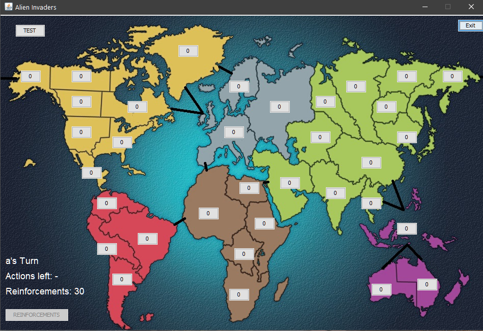

# AlienInvaders
A Java GUI-based game that I made as I was learning Java, based on the popular board game Risk.

--------------------------

## Usage
This project was created on netbeans IDE, using the netbeans provided GUI Editor. If you want to view and run the source code, please download the latest version of Apache 
netbeans IDE and open the project with it.

If you simply want to run the program, go to the dist folder and run the java executable inside. If you want to see the log output while the game is running, open the command 
line(cmd) in the same folder as the executable (or navigate there using cd command) and type -> java -jar "AlienInvaders.jar" <- (Without the arrows).

To get help with the game, consult the help menu from the in-game menu option.

### Quick start a game
There are 2 premade accounts, Username:a Password:a and Username:b Password:b, if you want to quickly start a new game. Refer to the help screen for help with profile management.

--------------------------
## Preview

